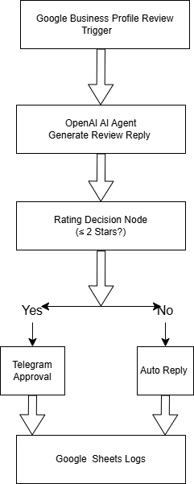
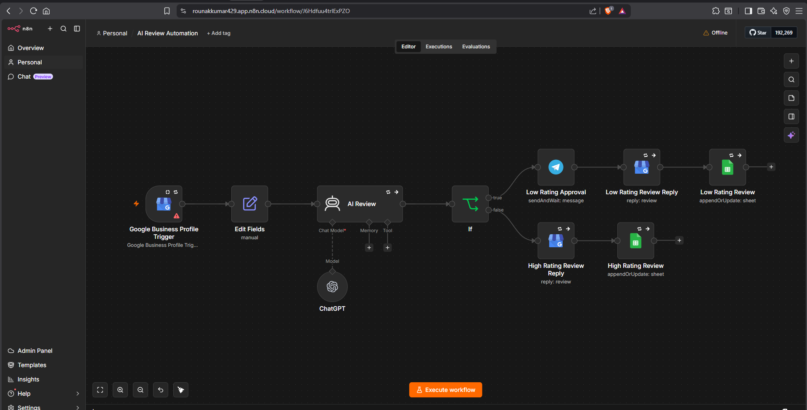

# 🚀 AI Review Management Automation System

An AI-powered Google Review Management System built with **n8n, OpenAI, Telegram, and Google Sheets** that automatically monitors customer reviews, generates intelligent responses, and enables human approval for negative reviews.

---

## 📌 Overview

Businesses receive customer reviews every day, but manually monitoring and responding to reviews takes time.

This system automates the entire process by:

- Monitoring new Google reviews
- Analyzing review sentiment
- Generating AI-powered responses
- Sending negative reviews for manual approval via Telegram
- Automatically posting approved replies
- Logging all activities in Google Sheets

---

## ✨ Features

✅ Automated Google Review Monitoring

✅ AI-Generated Review Replies

✅ Sentiment Analysis

✅ Instant Notifications for Negative Reviews

✅ Human-in-the-Loop Approval System

✅ Automated Reply Posting

✅ Google Sheets Logging

✅ Event-Driven Workflow Automation

---

## 🛠️ Tech Stack

- n8n Cloud
- OpenAI API
- Google Business Profile API
- Telegram Bot API
- Google Sheets API
- JavaScript (n8n Expressions & Functions)

---

## 🏗️ System Architecture



---

## 🔄 Workflow Screenshot



---

## ⚙️ Workflow Process

```text
Google Review
      ↓
Google Business Profile Trigger
      ↓
AI Agent (OpenAI)
      ↓
Generate Reply
      ↓
Rating Classification
      ↓
 ┌─────────────┬──────────────┐
 │             │
Low Rating   Positive Rating
 │             │
 ▼             ▼
Telegram      Auto Reply
Approval       Posting
 │             │
 └──────┬──────┘
        ▼
 Google Sheets Logging
```

---

## 📂 Repository Structure

```text
AI-Review-Management-System/
│
├── README.md
├── AI Review Automation.json
├── architecture.png
├── screenshots/
│      ├── workflow.png
│      └── telegram-approval.png
```

---

## 🎯 Use Cases

- Local Businesses
- Restaurants
- Clinics
- Gyms
- Real Estate Companies
- Agencies managing multiple Google Business Profiles

---

## 🚀 Future Improvements

- Multi-location Support
- Review Analytics Dashboard
- Multi-Agent Architecture
- Knowledge Base Integration (RAG)
- Multi-language Response Generation
- WhatsApp Notifications

---

## 👨‍💻 Author

**Rounak Kumar Sah**

AI Systems Engineer | AI Agent Developer | RAG Engineer

🔗 LinkedIn: https://www.linkedin.com/in/rounak-kumar-sah

🔗 GitHub: https://github.com/rounakkumarsah

---

## 📜 License

This project is licensed under the MIT License.
